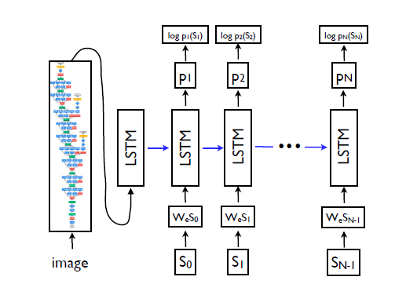

## 看图说话项目节点报告
- _小组成员：李雨阳，朱怡，臣生_


_第一周_
### 数据准备
##### 数据下载
````
 flickr8k下载地址:
 http://nlp.cs.illinois.edu/HockenmaierGroup/Framing_Image_Description/Flickr8k_Dataset.zip
 http://nlp.cs.illinois.edu/HockenmaierGroup/Framing_Image_Description/Flickr8k_text.zip   
````
````
coco:
http://images.cocodataset.org/zips/train2014.zip
http://images.cocodataset.org/zips/val2014.zip
http://images.cocodataset.org/annotations/annotations_trainval2014.zip
````
##### 数据格式的理解
- flickr8k
 - 原始数据结构如下
  ````
    + Flickr8k_Dataset                    <图片数据，共8000多张图片>
    + Flickr8k_text
      - CrowdFlowerAnnotations.txt        <图片与文字关联度>
      - ExpertAnnotations.txt             <图片与文字关联度>
      - Flickr_8k.devImages.txt           <验证集 共1000张图片，对应5000条训练数据>
      - Flickr_8k.testImages.txt          <测试集 共1000张图片，对应5000条训练数据>
      - Flickr_8k.trainImages.txt         <训练集 共6000张图片，对应30000条训练数据>
      - Flickr8k.lemma.token.txt          <对文字作了 lemmatized 处理>
      - Flickr8k.token.txt                <图片及对应的ground truth>
  ````
 - Lemmatized含义说明
 ```
 <raw caption>
 Two motorists are riding along on their vehicle that is oddly designed and colored .
 ```
 ```
 <lemmatized caption>
 Two motorist be ride along on their vehicle that be oddly design and color .
 ```
 - 数据格式理解及分析
   - 图片需要转换成指定大小传入。
   - 由于图片切割后和原有的groud truth未必会对应，在数据预处理时不考虑对图片进行切割。
   - 对caption需要进行word embedding预处理，并转换成对应的int类型的值，作为模型的输入。
   - 发现部分caption结尾没有句号'.'，在对数据进行预处理时可以考虑加上。
   - lemmatized后数据的有效单词数为2471，原始数据的有效单词为3081。考虑到word embedding已经起到了一定的降维和相似词整合的功能，lemmatized的作用应该不会太明显。且有效单词数量差并不明显(处于一个数量级内)。因此考虑使用原始caption作为输入数据处理。
- coco
```
TODO
```
- 资料查阅
  - 1411.4555论文
   - 采用CNN+RNN串联的方式，将CNN的输出作为RNN的第一个输入值
   
   - word embedding大小为512
   - 选择词频大于5的单词
   - 论文中没有提到cnn采用了哪种模型
   ````
   TODO
   ````

### 项目方案规划
##### 模型规划
- CNN模型部分
 - 现有成熟的CNN网络模型较多，可供选择的也比较多。如Inception, ResNet, VGG, NasNet等
 ```
 TODO
 如何选择CNN模型...
 ```
- RNN模型部分
 - 采用LSTM长短期记忆网络模型。
 - 隐层个数为rnn_layers
 - num_steps个数根据输入caption的长度动态变化。
 - 输入及隐层的特征数与Word Embedding的维度一致，与CNN层的logit输出维度也一致。
 - 输出维度为有效单词数量，在预处理word embedding的过程中确定。使用不同数据集时会有不同的值。
 - batch size 在实际训练过程中调整。

##### 系统规划-TODO
- 系统架构
- 输入输出
- 结果展示或分析
____
____

### 第二周结束目标
- 训练数据处理
- 模型训练
  - 训练过程出现的问题以及解决
  - 训练过程可视化
    - loss可视化
    - xxx
- 可用系统的搭建
  - 系统可以运行起来
  - 能够看到输入输出

### 第三周结束目标
- 模型训练完成
  - 结果可视化
  - 效果分析
- 系统搭建完成
  - 能运行并根据合理的输入给出合理的输出
  - 没有明显不合理的设计
    - 输入输出可操作
    - 对各种异常能够处理，系统不会崩溃
    - xxx

### 第四周结束目标
- 形成最终文档
  - 项目各个阶段中的坑
  - 心得体会
  - 项目不足与改进设想
  - 项目安装说明
  - 项目使用说明
  - 使用展示视频
