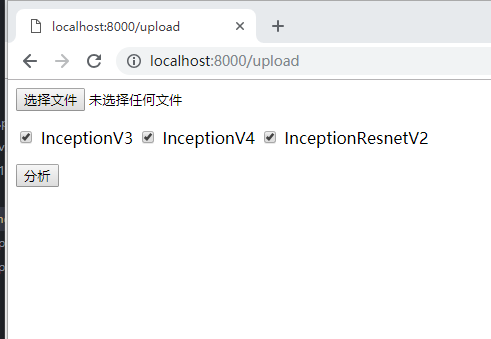

## 看图说话项目节点报告
- _小组成员：李雨阳，朱怡，张臣生_


_第一周_
### 数据准备
#### 数据下载
````
 flickr8k下载地址:
 http://nlp.cs.illinois.edu/HockenmaierGroup/Framing_Image_Description/Flickr8k_Dataset.zip
 http://nlp.cs.illinois.edu/HockenmaierGroup/Framing_Image_Description/Flickr8k_text.zip   
````
````
coco:
http://images.cocodataset.org/zips/train2014.zip
http://images.cocodataset.org/zips/val2014.zip
http://images.cocodataset.org/annotations/annotations_trainval2014.zip
````
#### 数据格式的理解
##### flickr8k
- 原始数据结构如下
  ````
    + Flickr8k_Dataset                    <图片数据，共8000多张图片>
    + Flickr8k_text
      - CrowdFlowerAnnotations.txt        <图片与文字关联度>
      - ExpertAnnotations.txt             <图片与文字关联度>
      - Flickr_8k.devImages.txt           <验证集 共1000张图片，对应5000条训练数据>
      - Flickr_8k.testImages.txt          <测试集 共1000张图片，对应5000条训练数据>
      - Flickr_8k.trainImages.txt         <训练集 共6000张图片，对应30000条训练数据>
      - Flickr8k.lemma.token.txt          <对文字作了 lemmatized 处理>
      - Flickr8k.token.txt                <图片及对应的ground truth>
  ````
- Lemmatized含义理解
  ```
  <raw caption>
  Two motorists are riding along on their vehicle that is oddly designed and colored .
  ```
  ```
  <lemmatized caption>
  Two motorist be ride along on their vehicle that be oddly design and color .
  ```
- 数据格式理解及分析
   - 图片需要转换成指定大小传入。
   - 由于图片切割后和原有的groud truth未必会对应，在数据预处理时不考虑对图片进行切割。
   - 对caption需要进行word embedding预处理，并转换成对应的int类型的值，作为模型的输入。
   - 发现部分caption结尾没有句号'.'，在对数据进行预处理时可以考虑加上。
   - lemmatized后数据的有效单词数为2471，原始数据的有效单词为3081。考虑到word embedding已经起到了一定的降维和相似词整合的功能，lemmatized的作用应该不会太明显。且有效单词数量差并不明显(处于一个数量级内)。因此考虑使用原始caption作为输入数据处理。
   - Annotations.txt的作用目前没有太明白，应该类似于用户对结果的反馈评分机制。但如何运用到模型中去训练还没想清楚。

##### coco
- coco数据集目前尚未使用。

### 资料查阅
- 1411.4555论文
     - 采用CNN+RNN串联的方式，将CNN的输出作为RNN的第一个输入值
   

   - word embedding大小为512
   - 要求对描述语句进行'tokenization'的预处理，我们理解为仅仅只是断词，并不需要lemmatized。但需要选择词频大于5的单词参与训练。
   - cnn有预训练模型，rnn参数从0初始化。为防止cnn预训练模型被带偏，在初始训练时需要固定cnn参数，仅训练rnn。
   后期再一起参与训练。
   - 论文中没有提到具体cnn采用了哪种模型，现有的成熟模型都可以纳入考虑。

### 项目方案规划
#### 模型规划
- CNN模型部分
  - 现有成熟的CNN网络模型较多，可供选择的也比较多。如Inception, ResNet, VGG, NasNet等
  - 仅从目前模型评价上来看，考虑到和Google的兼容性，计划采用Inception-RestNet-v2模型，20160830的预训练参数。
  - 图片输入尺寸为299*299
  - logits输出维度为[1, 1, dim_embedding]
  - 初始训练时需要锁定cnn的预训练参数。
- RNN模型部分
  - 采用LSTM长短期记忆网络模型。
  - 隐层个数为rnn_layers
  - num_steps个数根据输入caption的长度动态变化。
  - 输入及隐层的特征数与Word Embedding的维度一致，与CNN层的logit输出维度也一致。
  - 输出维度为有效单词数量，在预处理word embedding的过程中确定。使用不同数据集时会有不同的值。
  - batch size 在实际训练过程中调整。
- loss计算
  - 论文中采用的是分别计算每个词的loss并求和。但我们考虑到每句话单词数量各不相同(num_step)，会大概率导致长语句的loss偏大。会采用loss平均值来计算。

#### 系统规划
- 系统架构
  - 可运行的系统采用BS架构。
- 输入输出
  - 前端提供图片本地路径选择或URL作为输入。
  - 后端根据输入的图片，调用训练好的模型参数进行计算并输出结果语句。
- 结果展示或分析
  - 预测结果可视化
  - 根据用户反馈可进一步训练模型。

____
____


_第二周_
### 训练数据处理
- 采用的训练数据集为Flickr8k
- 参考im2txt对coco数据集的处理，修改了数据训练代码
- 设置train_shards=8 val_shards=1
- 
- 修改_bytes_feature函数，对图片和字符串格式分开使用了不同的函数
- 

### 模型训练
- #### 训练过程出现的问题以及解决
  - 训练num_steps的选择。由于flickr8k训练集的大小约为coco的1/20，我们想法是mun_steps也为50000步。
  - 

  - 
  - 设置train_inception=true，继续训练10000步
  - 

  - 遇到了训练好的checkpoint在本地无法调用的问题。后来发现需要checkpoint文件，并修改文件中ckpt的相对路径后成功加载恢复。

### 可用系统的搭建
  - 系统可以运行起来，如图所示
    - 
  - 输入：界面提供了选择文件的按钮，选择用户本地的文件
    - 
  - 输出：分析后生成预测结果，并提供用户反馈按钮
    - 

### 遇到的问题及下一阶段计划
  - 实际生成caption的过程中，计算过程稍慢，需要20-30秒左右。有没有可以提速的方法？
  - 提高生成语句的准确率，方法包括:
    - 更换数据集
    - 更换cnn模型
    - 增加训练步数num_steps
    - 调用训练过模型的checkpoint
  - 对界面异常情况进行处理，如
    - 选择非图片文件
    - 未选择文件直接点击分析
    - 无法生成caption
    - 增加多张图片批处理功能
    - 可以对每句话分别评分
  - 将用户反馈的数据加入模型训练过程，并能起到一定的影响。

____
____


_第三周_
### 模型训练完成
- 训练了InceptionV3， InceptionV4， InceptionResnetV2共三个模型。
- 采用的数据集: __Flickr8k__
- 三个模型的对比分析如下：

  ##### 学习率 Learning_rate
- 三个模型采用一样的学习率
- 前10w步学习率根据epoch，学习率从2开始递减
- 10w步以后固定为0.0005
- 

  ##### 模型训练时间 step/sec
- InceptionV3
- 
- InceptionV4
- 
- InceptionResnetV2
- 
- 从训练时间上来看
  - cnn不训练： InceptionV3 > InceptionResnetV2 > InceptionV4
  - cnn训练后： InceptionV3 > InceptionResnetV2 ≈ InceptionV4
  - 这个速度也符合对这三个模型设计上的定义：
    - InceptionV4比InceptionV3深度更深，因此在训练和计算上都花费了更多的时间。
    - IncpetionResnetV2优化了InceptionV4的训练速度，因此速度较InceptionV4较快。

  ##### batch_loss
- InceptionV3 （处于1.7-1.9的区间范围内）
- 
- InceptionV4 （处于1.6-2.0的区间范围内）
- 
- InceptionResnetV2 （处于1.3-1.8的区间范围内）
- 
- 训练过程中batch_size值为16
- 从batch_loss值的大小来看：InceptionResnetV2 < InceptionV3 < InceptionV4
- 从batch_loss值的震荡范围来看： InceptionV3 < InceptionV4 < InceptionResnetV2
- 由此分析推断，整体生成效果上：InceptionResneV2会好于其他两个模型；但对于某些特定的输入，输入结果可能存在较大的差异，不如InceptionV3输出的结果稳定。

##### total_loss
- InceptionV3 （处于1.8-2.0的区间范围内）
- 
- InceptionV4 （处于2.0-2.4的区间范围内）
- 
- InceptionResnetV2 （处于1.7-2.2的区间范围内）
- 
- 整体情况与batch_loss类似。
- InceptionV3的变化范围更小
- InceptionResnetV2收敛后的loss值更小，但浮动较大。

##### 效果分析
- 由于flickr8k原本的数据集就比较小，参照词频表对效果进行了一些分析：
- __flickr8k测试集效果测试__
  - 数据集中出现最多的名字为"_dog_"，共出现了__6158__次
  - 
  - 
  - 对dog的识别相当准确，dog身上的毛发颜色识别的也不错。动作描述略有差别，InceptionResnetV2模型稍好一些。
  - 
  - 这张图三个模型识别的差别相当明显。InceptionV4的语句略短，且没有识别出court dribbling，衣服颜色等关键词。
  - 只有InceptionResnetV2模型识别出了dribbling这个动作。这个词在词频表里出现的次数仅5次。说明InceptionResnetV2模型对低频词的学习和使用较为频繁。另一个类似的例子是：
  - 
  - 这里使用petting更为准确。但InceptionResnetV2模型多次使用了tug of war 这个冷僻的词组结构。它在训练集中仅仅出现过__2__次。
- __范围外的图像效果测试__
  - 
  - 由于词组表中没有zebra，导致测试结果惨不忍睹。
  - 结果中出现的man/woman/boy/girl/child都是词频表中出现次数最多的一些名词（2000-5000次）
  - 唯一欣慰的是InceptionResnetV2中出现了horse这个单词。他在词频表里出现了169次。
- __网络图片效果测试__
  - 
  - 词库中关于雪的出现的次数比较多，网上找了一些雪景的图片测试，效果还不错。
  - 
  - 对于高频词的处理InceptionResnetV2表现并不太好。如上例中，对man/woman的区分并不明显，语句也并不通顺。反而InceptionV4表达的意思更准确。

### 系统搭建完成
  - 能运行并根据合理的输入给出合理的输出
    - 系统主界面
    - 
    - 生成结果图片，支持三种模型的结果的同时预测
    - 
  - 一些异常和故障处理
    - 选择文件对话框对文件类型做了筛选，只能选择图片类型的文件。如jpg/jpeg/png
    - 
    - 对文件的最小尺寸有限制，尺寸过小会弹出提示
    - 
    - 直接点击提交按钮有错误提示
    - 
    - 计算过程中重复提交图片，会有不要重复点击提示
    - 


_第四周_
- 项目各个阶段中的坑
  - 建模过程
  - 数据生成


- 心得体会
- 项目不足与改进设想
- 项目安装说明
  - 数据格式生成环境配置
    - 生成mscoco tfrecord数据的脚本为 /im2txt/data/build_mscoco_data.py
    - 命令参数说明如下
    ````
    python build_mscoco_data.py \
    --train_image_dir="./train2014" \   ## 训练集图片目录
    --val_image_dir="./val2014" \       ## 验证集图片目录
    --train_captions_file="./captions_train2014.json" \ ## 训练集标签所在路径
    --val_captions_file="./captions_val2014.json" \     ## 验证集标签所在路径
    --output_dir="./outputs" \          ## 输出文件目录
    --word_counts_output_file="./word_counts.txt"       ## 输出词频文件路径
    ````
    - 生成flickr8k tfrecord数据的脚本为 /im2txt/data/build_flickr8k_data.py
    ````
    python build_flickr8k_data.py \
    --train_image_dir="./images" \     ## 图片集目录
    --val_image_dir="./images" \       ## 图片集目录
    --captions_file="./Flickr8k.token.txt" \ ## 图片标签所在路径
    --output_dir="./outputs" \         ## 输出文件目录
    --word_counts_output_file="./word_counts.txt"       ## 输出词频文件路径
    ````
  - 模型训练环境配置
    - 模型训练的脚本为 /im2txt/train.py
    - 命令及参数说明如下
    ````
    train.py
    --
    ````
    -
    - configuration.py中的部分参数需要根据项目情况修改
    `````
    ddd
    `````
  - web界面及后端环境配置
  - web服务器安装及配置
- 项目使用说明
  - 在安装部署完成的项目上，通过以下命令启动服务器
  ````
  python manage.py runserver
  ````
  - 在浏览器中如下输入，启动客户端界面
  ````
  http://localhost:8000/upload
  或其他项目环境配置的ip地址和端口
  ````
  - 通过一些时间的启动加载后，网页上应显示如下内容（启动加载时间取决于服务器端模型加载的速度）
  - 
    - 选择文件按钮可以选择本地的一张图片进行看图说话的操作。建议选择图片尺寸大于299×299
    - 三个勾选框对应三个不同的看图说话模型，建议全勾选以获得最好的生成效果。每种模型将生成3条语句。三个模型共9条。
    - 分析按钮会提交当前选择的图片信息，对该图片进行计算。计算过程中请勿重复提交。
  - 选择文件
  - 选择模型
  - 结果显示
- 使用展示视频
